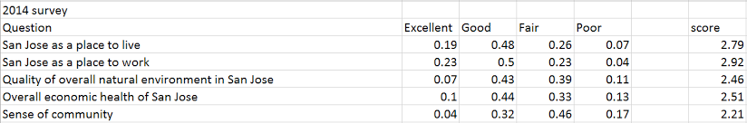

Should you move to San Jose predictor app
========================================================
author: Lynna Jirpongopas
date: Sun Dec 21 11:27:50 2014

Introduction
========================================================

This application is a fun application to compare one's satisfaction of living in their city versus San Jose citizens' satisfaction of living in San Jose.  

A user only has to:
  - disclose the name of their city (eg. Austin)
  - rate their city based on 5 criterias
  
Then the app will predict whether the user would be happier continuing to live in their city or move to San Jose.

Assumptions
========================================================
We make the following assumptions in our calculations:
  - An individual weights the 5 criterias about a city equally.
  - An individual's possible satisfaction for San Jose is the same as the average San Jose citizens' satisfaction. 

Score calculation
========================================================
This is what a subset of the results from the 2014 survey looks like:

Each record shows the distribution of answers for each question.  For example, the first record shows that 19% of the San Jose residents who took the survey said that as a place to live, San Jose is excellent.

We arbitarily assigned a number score to each categorical answer: "Excellent" is equivalent to score of 4, "Good" is 3, "Fair" is 2, and Poor is 1

Score calculation
========================================================
A score for each question is calculated by weights.  For instance,  San Jose as a place to live gets a score of 2.79, which is calculated like this 0.19(4) + 0.48(3) + 0.26(2) + 0.07(1)

The scores from each question is then weighted equally to obtain the final San Jose satisfaction score of: 2.578

So based on your answers on the app, your city's score is then calculated.  Then it gets compared against 2.578.

The San Jose 2014 survey results are available here: http://data.sanjoseca.gov/datastreams/89222/national-citizens-survey-results-2014/
